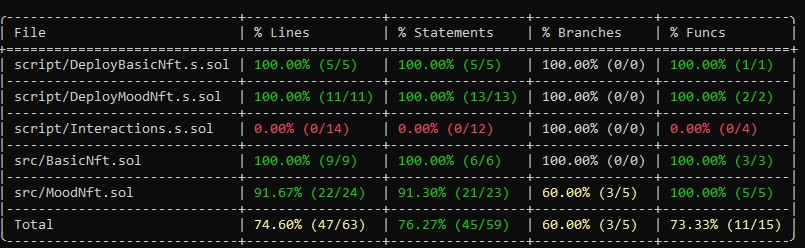

# Foundry NFTs

This project showcases the development of Non-Fungible Tokens (NFTs) using the Foundry framework. It includes two main smart contracts: `BasicNft.sol` and `MoodNft.sol`, each demonstrating different aspects of NFT creation and management.

## Smart Contracts

### BasicNft.sol

The `BasicNft.sol` contract is a straightforward implementation of the ERC721 standard. It allows for the creation of basic NFTs with a specified token URI.

**Key Features:**

*   **ERC721 Compliance:** Fully compliant with the ERC721 standard from OpenZeppelin.
*   **Customizable Token URI:** Each NFT can have a unique URI pointing to its metadata.
*   **Simple Minting:** A public `mintNft` function allows anyone to mint a new NFT.

### MoodNft.sol

The `MoodNft.sol` contract introduces a dynamic aspect to NFTs. Each NFT has a "mood" that can be changed by its owner.

**Key Features:**

*   **Dynamic SVG-Based NFTs:** The appearance of the NFT changes based on its mood (Happy or Sad).
*   **On-Chain Metadata:** The token URI is generated on-chain, and the image is an SVG stored directly on the blockchain.
*   **Owner-Controlled Mood Changes:** Only the owner of an NFT can change its mood using the `flipTokenMood` function.
*   **Enum for Moods:** Uses an `enum` to represent the possible moods of the NFT.

## Getting Started

This project uses [Foundry](https://book.getfoundry.sh/), a fast, portable, and modular toolkit for Ethereum application development.

### Build

Compile the smart contracts:

```shell
$ forge build
```

### Test

Run the test suite:

```shell
$ forge test
```

### Coverage

Generate a test coverage report:

```shell
$ forge coverage
```


### Format

Format the code:

```shell
$ forge fmt
```

### Gas Snapshots

Generate gas snapshots:

```shell
$ forge snapshot
```

### Anvil

Start a local Anvil node:

```shell
$ anvil
```

## Deployment

### Local Deployment

Deploy the `BasicNft` contract to a local Anvil node:

```shell
$ forge script script/DeployBasicNft.s.sol:DeployBasicNft --rpc-url $ANVIL_RPC_URL --broadcast --account defaultKey
```

### Sepolia Deployment

The `BasicNft` contract has been deployed and verified on the Sepolia testnet:
[0x0a01d05962bb2549801c2251300d833d9c2e820b](https://sepolia.etherscan.io/address/0x0a01d05962bb2549801c2251300d833d9c2e820b#code)

To deploy to Sepolia, use the following command:

```shell
$ forge script script/DeployBasicNft.s.sol:DeployBasicNft --rpc-url $SEPOLIA_RPC_URL --account sepoliaAccount2 --broadcast --verify --etherscan-api-key  $ETHERSCAN_API_KEY -vvvv
```

## Interacting with the Contracts

You can interact with the deployed contracts using `cast`. For example, to change the mood of a `MoodNft`, use the `flipTokenMood` function:

```shell
cast send <CONTRACT_ADDRESS> "flipTokenMood(uint256)" <TOKEN_ID> --rpc-url $SEPOLIA_RPC_URL --account sepoliaAccount2
```

## Donations

If you found this project helpful, feel free to follow me or make a donation!

**ETH/Arbitrum/Optimism/Polygon/BSC/etc Address:** `0x2210C9bD79D0619C5d455523b260cc231f1C2F0D`

## Contact

[](https://x.com/GaBoEgui)
[](https://www.linkedin.com/in/gabrieleguiguren/)